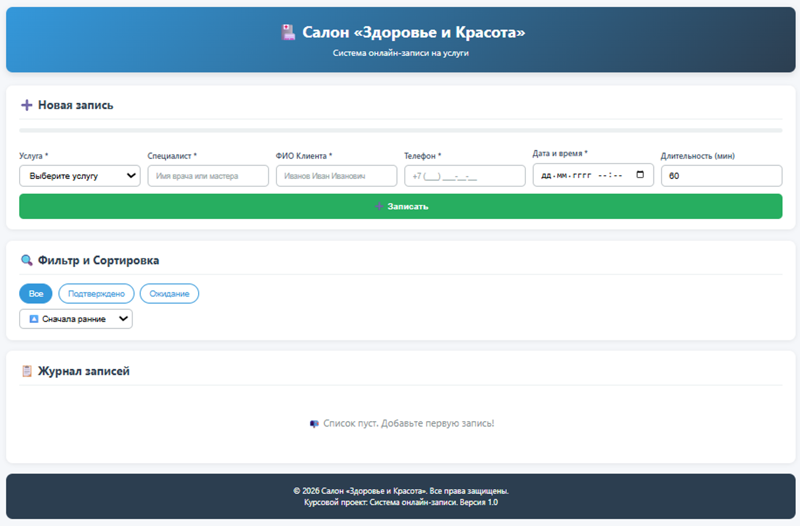
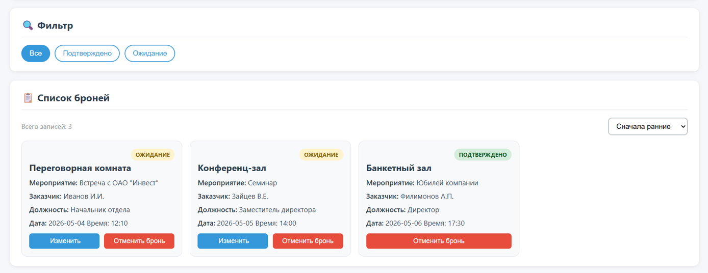
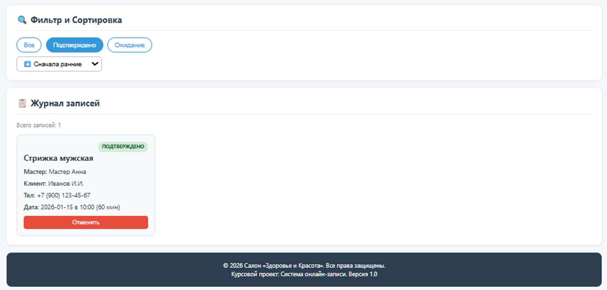

# Практическая работа: Подготовка к курсовой работе. Архитектура SPA, интеграция компонентов

**Тема курсового проекта:** Система онлайн-записи на услуги салона «Здоровье и красота»

## 📄 Описание проекта

Данный проект является архитектурным прототипом для будущего курсового проекта. Реализовано мини-SPA приложение для салона красоты, которое позволяет:

1. Создавать новые записи на услуги (с валидацией телефона РБ и выбором даты).
2. Просматривать список записей в виде карточек.
3. Фильтровать записи по статусу («Ожидание», «Подтверждено»).
4. Сортировать записи по времени (ближайшие/поздние).
5. Удалять неактуальные записи.
6. Сохранять данные в `localStorage` для сохранения между перезагрузками.

Проект демонстрирует принципы **однонаправленного потока данных**, **управляемых форм** и **подъёма состояния (Lifting State Up)**.

---

## 🎤 Ответы на вопросы Interview Corner

### 1. Что такое «однонаправленный поток данных» в React? Почему это удобно?

Однонаправленный поток данных (Unidirectional Data Flow) означает, что данные в приложении передаются только в одном направлении: от родительских компонентов к дочерним через `props`. Если дочернему компоненту нужно изменить данные, он не делает этого напрямую, а вызывает функцию-колбэк, переданную родителем.
**Почему удобно:** Это делает поток данных предсказуемым. Мы всегда знаем, где находится источник истины (state), и легко отслеживаем, где и почему изменились данные. Это упрощает отладку сложных приложений.

### 2. Что такое lifting state up? Приведите пример из Вашей практической работы.

Lifting State Up (подъём состояния) — это паттерн, при котором состояние, общее для нескольких компонентов, перемещается в их ближайшего общего предка.
**Пример из работы:** Список записей (`items`) и функции добавления/удаления (`handleAddItem`, `handleDelete`) хранятся в `App.js`. Компоненты `BookingForm` (форма) и `ServiceCard` (карточка) не хранят свои данные самостоятельно. Форма вызывает `onAddItem`, а карточка вызывает `onDelete`, передавая события наверх в `App.js`, который обновляет общий список.

### 3. Как дочерний компонент сообщает родителю о событии? Почему нельзя изменить state родителя напрямую?

Дочерний компонент сообщает о событии, вызывая функцию-колбэк, которую родитель передал ему через `props` (например, `props.onDelete(id)`).
**Почему нельзя напрямую:** В React `props` доступны только для чтения. Прямое изменение `props` или `state` родителя нарушило бы реактивность React: фреймворк не узнал бы об изменении и не запустил бы перерисовку (re-render) интерфейса.

### 4. Что такое управляемый компонент (controlled component)? Зачем нужен атрибут value у input?

Управляемый компонент — это элемент формы, значение которого контролируется состоянием React (`useState`).
**Зачем нужен `value`:** Атрибут `value` связывает поле ввода со стейтом. Если мы хотим, чтобы пользователь мог менять текст, мы обязаны добавить обработчик `onChange`, который будет обновлять стейт. Это позволяет React быть единственным источником истины для данных формы, давая возможность валидировать ввод или блокировать поля программно.

### 5. Что такое паттерн «компонент-обёртка» (wrapper component)? Как работает children?

Компонент-обёртка — это компонент, который не генерирует контент сам, а предоставляет каркас (layout) для других компонентов.
**Как работает `children`:** Специальная prop `children` позволяет вкладывать JSX-разметку или другие компоненты внутрь обёртки при её вызове. Например, `<Layout><Form /></Layout>` передаст компонент `Form` внутрь `Layout` как `props.children`. Это избавляет от дублирования кода шапки и подвала сайта.

### 6. Почему в React предпочтительна композиция, а не наследование?

React построен на идеологии композиции — создания сложных интерфейсов путем объединения простых компонентов. Наследование (как в ООП) в React не используется, так как ведет к жестким связям и сложной иерархии классов. Композиция (через `props` и `children`) более гибкая: мы можем легко переиспользовать компоненты, передавая им разное поведение через пропсы, не меняя их внутреннюю реализацию.

### 7. Зачем нужен useEffect для работы с localStorage? Что такое «побочный эффект» (side effect)?

**Побочный эффект (Side Effect)** — это любая операция, которая влияет на что-то вне текущего компонента (сеть, DOM, localStorage, таймеры).
**Зачем нужен `useEffect`:** Рендеринг компонентов должен быть чистым (детерминированным). Мы не можем писать в `localStorage` прямо внутри тела функции компонента, так как это вызовет бесконечный цикл или замедлит рендер. `useEffect` позволяет выполнить этот код _после_ того, как DOM обновлен, безопасно синхронизируя React с внешним хранилищем.

---

## 🚀 Связь с курсовым проектом

Эта практическая работа заложила фундамент для моего курсового проекта **«Система онлайн-записи»**:

1.  **BookingForm.jsx** стал прототипом формы записи клиента. В курсовом проекте я добавлю интеграцию с API для проверки свободных слотов времени мастеров.
2.  **ServiceCard.jsx** эволюционирует в детальную карточку услуги с возможностью выбора конкретного времени и мастера.
3.  **App.js** с логикой `localStorage` будет заменен на работу с реальным сервером (Node.js/Express или Firebase), но архитектура хранения состояния останется прежней.
4.  Реализованная валидация (включая проверку телефона) будет расширена для поддержки авторизации пользователей.

---

## 📸 Скриншоты

### 1. Форма добавления новой записи пуста

### 2. Список записей

### 3. Фильтрация данных

---

## 🛠 Инструкция по запуску

1.  Клонируйте репозиторий: `git clone https://github.com/igorao2802-dev/spa-mini-practice`
2.  Установите зависимости: `npm install`
3.  Запустите проект: `npm start`

---

**Выполнил:** Осадчий Игорь  
**Дата:** 06.05.2026
